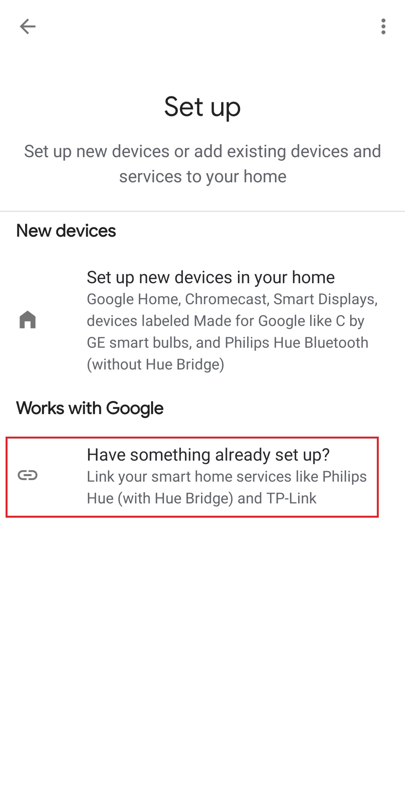
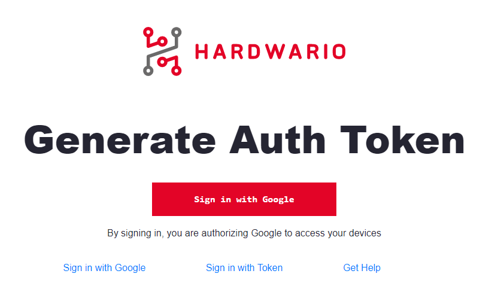
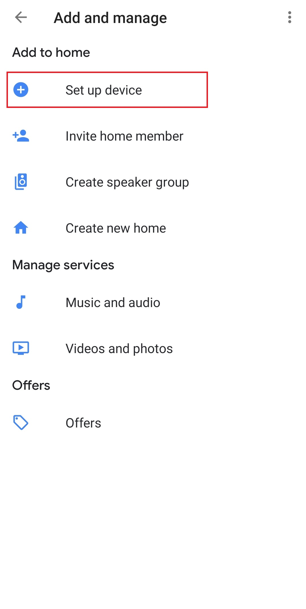
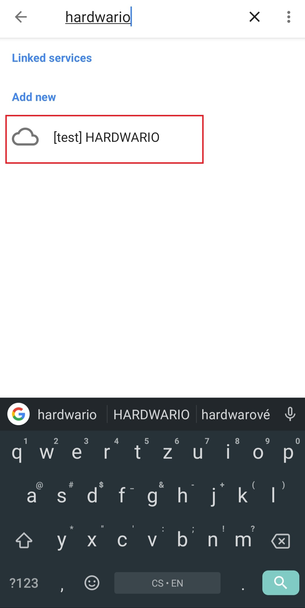
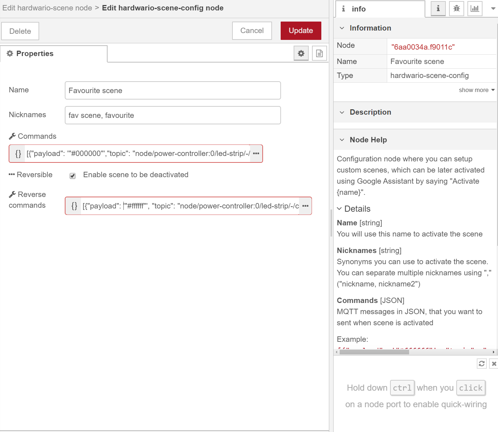
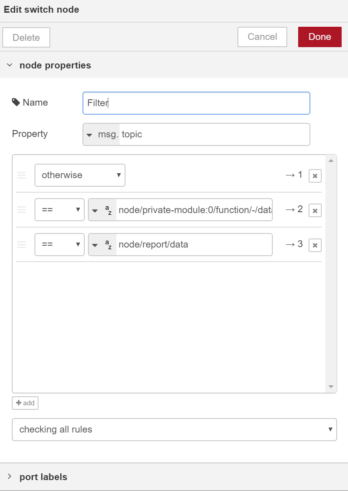

# Google Assistant

With the Google Assistant integration, you can control your HARDWARIO IoT Kits with the Google Assistant.

For now, you can control:

* [Power Controller](https://shop.hardwario.com/power-controller-kit/)
  * Control brightness, color, on/off, relay, effects, modes
  * Get temperature and battery status
* [Radio Dongle](https://shop.hardwario.com/radio-dongle/)
  * Turn on/off to start pairing
* [Push Button](https://shop.hardwario.com/push-button-kit/)
  * Turn on/off to simulate the button press
  * Get temperature and battery status
* [Motion Detector](https://shop.hardwario.com/motion-detector-kit/) \(see the instructions at the end\)
  * Arm/Disarm - sends specific topic you can use
  * Get temperature and battery status
* [Climate Monitor](https://shop.hardwario.com/climate-monitor-kit/)
  * Get humidity, temperature and battery status
* [VOC Sensor](https://shop.hardwario.com/voc-lp-tag/)
  * Get air quality, temperature and battery status
* [Flood Detector](https://shop.hardwario.com/flood-detector-kit/)
  * Get flood status, temperature and battery stats


**What is Google Assistant?**  
Google Assistant is a voice assistant, made by Google. Available on billions of devices, you can use it to do many things. Now, even control your HARDWARIO IoT Kits.


## Setup

Setup will be done in 2 steps:

1. Adding Node-RED nodes to enable Google Assistant support
2. Google Home app set-up

## Prepare your modules

Please set up at least one of the supported modules using [Projects guides](../projects/push-the-button.md) with the standard firmware. Google Assistant will use Node-RED to communicate with your Hub in the background and fulfill your commands.

**Make sure you have your kit successfully running before you move to next steps.**

## Node-RED setup

### **Step 0: Open Node-RED**

Open **Node-RED** in [**HARDWARIO Playground**](https://developers.bigclown.com/basics/bigclown-playground) in the **Functions** tab or in your web browser [**http://localhost:1880/**](http://localhost:1880/)

### **Step 1: Install Node-RED package**

Select _Manage pallete_ from the right menu


Click on **install tab** and type _hardwario_ into the search field. Confirm _@hardwario/node-red-contrib-hardwario-voice_ by pressing install.



### **Step 2: Import flow**

Open the right menu -&gt; Import -&gt; Examples and select HARDWARIO Google Assistant from the package folder


Or import following JSON:

```text
[{"id":"90a4c19d.773d5","type":"mqtt out","z":"f12ddf57.809","name":"","topic":"","qos":"","retain":"","broker":"a5605d5c.f080e","x":702.000020980835,"y":767.0000238418579,"wires":[]},{"id":"8326e88f.cf6338","type":"mqtt in","z":"f12ddf57.809","name":"","topic":"#","qos":"2","broker":"9f1d47fd.82cff8","x":251.00000381469727,"y":768.0000228881836,"wires":[["d9d67844.d6f638","77456e04.0fb01"]]},{"id":"77456e04.0fb01","type":"hardwario-voice","z":"f12ddf57.809","name":"","cred":"","x":475.16668701171875,"y":767.3333129882812,"wires":[["90a4c19d.773d5"]]},{"id":"a5605d5c.f080e","type":"mqtt-broker","z":"","broker":"localhost","port":"1883","clientid":"","usetls":false,"compatmode":true,"keepalive":"60","cleansession":true,"willTopic":"","willQos":"0","willPayload":"","birthTopic":"","birthQos":"0","birthPayload":""},{"id":"9f1d47fd.82cff8","type":"mqtt-broker","z":"","broker":"localhost","port":"1883","clientid":"","usetls":false,"compatmode":true,"keepalive":"60","cleansession":true,"willTopic":"","willQos":"0","willPayload":"","birthTopic":"","birthQos":"0","birthPayload":""}]
```

It will look like this:



This snippet prepares Node-RED to fulfill commands from Google Assistant while updating the devices states


### Step 3: Get your Auth token

Go to [HARDWARIO Auth page](http://ga.hardwario.com/) and sign in using a Google Account which you are using with Google Assistant. In your email, you will receive an Auth token.



Check your email address associated with the Google account you used to sign in.

### Step 4: Configure

Configure the **Google Assistant node** with the correct Auth token. Use the pencil icon on the right to create a new token config with your token.

### Step 5: Deploy

Deploy the flow using the **Deploy** button in the top-right corner.

The nodes should after a few seconds show the _connected_ status like this:


### Possible errors

* _Missing token_
  * Make sure that your Auth token is correctly filled out
* _Pairing error_
  * Verify that your Auth token and the token you have received in your email match
* _Not receiving/sending any messages_
  * Try to restart Node-RED/HARDWARIO Playground, if it doesn't resolve the issue, contact us in the chat

## Google Assistant setup

To complete Google Assistant setup, **you need a mobile device**.

### Step 1: Google Home app

Open the Google Home app \([Android](https://play.google.com/store/apps/details?id=com.google.android.apps.chromecast.app&hl=en), [iOS](https://apps.apple.com/us/app/google-home/id680819774)\)

Create a new home if needed to complete the initial setup.

### Step 2: Add service

**Make sure to have some devices connected \(paired to the Dongle\), before continuing.**

Press the + button in the top left corner to add a new service.


Tap on _Setup device_, then select _Have something already setup?_

 

Search for **HARDWARIO** a pick it from the list. You will see a website, use it to Sign in with either your Google account or token. This has to be a same account/token as you used before.



### Step 3: Test your devices

After the previous step, you will see your paired modules at the end of the main screen as _Linked to you_.

Tap on each device to assign a room or change it's name.

Integration is ready to be used now.

## Example commands

Get some inspiration for things you can say!

Hey Google:

* Turn on the Power Controller
* Turn off relay on Power Controller
* Set the color to red
* What is the Push Button battery level?
* Set the brightness to 50%
* Lower the brightness
* What is the temperature of Push Button
* What is the humidity of Climate Monitor
* Turn on the Push Button
* Disarm the Motion Detector
* Turn on the Radio Dongle \(starts pairing mode\)

## Scenes

Use a scene node to create custom commands that you can activate using Google Assistant.

Set up the Scene node with Scene config and connect it to either MQTT node or as an input to Voice node.


Fill out the Scene node config:



Save the changes to the config and press **Deploy**

Now you can use the button left to the Scene node to send the update.


Your node is node updated and you can activate it by saying _"Hey Google, activate {scene name}"_ if you choose to make it reversible, different commands will be sent by saying _"Hey Google, deactivate {scene name}"_

### Dynamic scenes

You can set up dynamic scenes, which are set based on some conditions in real-time. You can do this by importing the following nodes as an example.


```text
[{"id":"47e1ca7.8849d34","type":"inject","z":"8a5b93d7.0fff5","name":"Update scene","topic":"","payload":"","payloadType":"date","repeat":"","crontab":"","once":false,"x":376,"y":217.00000667572021,"wires":[["c8b3c85d.965198"]]},{"id":"c8b3c85d.965198","type":"function","z":"8a5b93d7.0fff5","name":"Dynamic scene","func":"msg.topic = \"node/testScene/scene/-/set\";\nmsg.payload = {\n    name: \"Test scene\",\n    id: \"testScene\", //id must match id in topic\n    alias: \"testScene\",\n    nicknames: [\n        \"Test scene\",\n        \"Testing scene\"\n        ],\n    commands: [\n        {\n            topic: \"node/power-controller:0/led-strip/-/color/set\",\n            payload: '\"#ffffff(00)\"'\n        }\n        ],\n    reverseCommands: [\n        {\n            topic: \"node/power-controller:0/led-strip/-/color/set\",\n            payload: '\"#000000(00)\"'\n        }\n        ],\n    reversible: true\n}\nmsg.payload = JSON.stringify(msg.payload);\nreturn msg;","outputs":1,"noerr":0,"x":565.0000953674316,"y":217.0000467300415,"wires":[["c4a9ef46.d553"]]}]
```

## Other

### Filter send messages

Use the **Switch node** for any messages that you don't want to be sent to the Google Assistant. Place the switch node between the MQTT out and Google Assistant node and connect just the first output to the Google Assistant node.

Fill out all the message topics that you don't want to be sent.

 

### Change the number of batteries

As default we use the number of batteries that were provided in the Kit, if you have changed for example the [Mini Battery Module](https://shop.hardwario.com/battery-module/) \(2x AAA\) to [Battery Module](https://shop.hardwario.com/battery-module/), you can update Google Assistant with following MQTT message, this will ensure that you get correct responses.

```javascript
{
    payload: 2, // 2 or 4
    topic: `node/{moduleId}/batteries/-/set`,
}
```

### Rename your modules

Use the Google Home app to change the default names to something you like.

Or you can use custom MQTT message to rename the module using Node-RED:

```javascript
{
    payload: "New name",
    topic: `node/{moduleId}/name/-/set`,
}
```

### Motion Detector setup

You can arm/disarm the [Motion Detector](https://shop.hardwario.com/motion-detector-kit/) using Google Assistant. It will send the following MQTT message:

```javascript
{
    payload: true, // true or false
    topic: `node/motion-detector:0/pir/-/armed`,
}
```

You can use this message to create conditions and flow to limit the Motion Detector.

Feel free to modify the example you can get from _Menu -&gt; Import -&gt; Examples -&gt; Package name -&gt; Alarm example_


